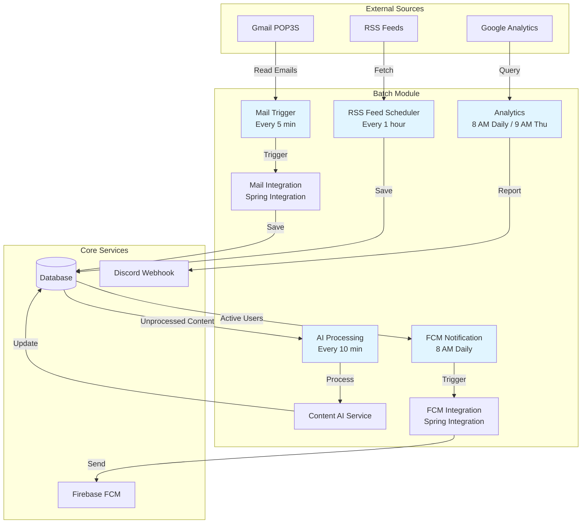
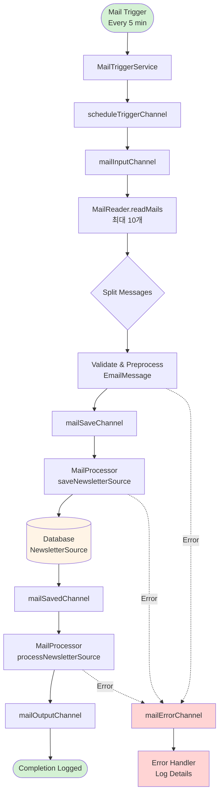
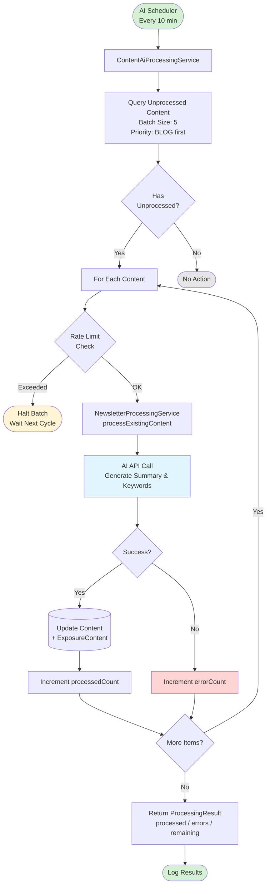
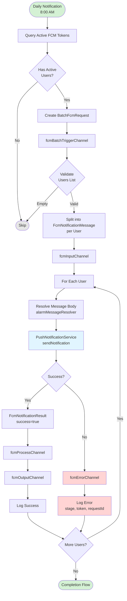
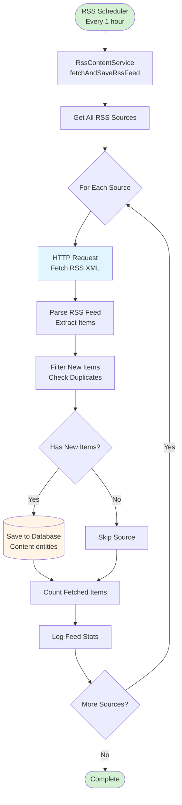
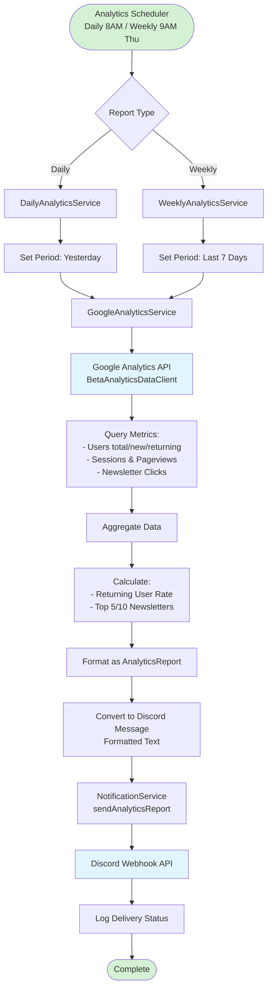

# Newsletter Feeder Batch Module

## 📋 목차
- [개요](#-개요)
- [아키텍처](#-아키텍처)
- [배치 작업 목록](#-배치-작업-목록)
- [주요 플로우](#-주요-플로우)
- [설정](#-설정)
- [실행 방법](#-실행-방법)
- [API 엔드포인트](#-api-엔드포인트)
- [트러블슈팅](#-트러블슈팅)

---

## 📌 개요

Newsletter Feeder의 Batch 모듈은 뉴스레터 처리를 위한 배경 작업들을 자동화하는 Spring Boot 애플리케이션입니다.

### 주요 기능
- 📧 **이메일 뉴스레터 수집**: POP3S를 통한 Gmail 뉴스레터 자동 수집
- 🤖 **AI 컨텐츠 처리**: 수집된 컨텐츠의 요약 및 키워드 자동 생성
- 📡 **RSS 피드 수집**: 설정된 RSS 소스로부터 자동 피드 수집
- 🔔 **푸시 알림 발송**: 매일 아침 사용자에게 FCM 푸시 알림 전송
- 📊 **Analytics 리포팅**: Google Analytics 데이터 집계 및 Discord 전송

### 기술 스택
- **Framework**: Spring Boot 3.x
- **Language**: Kotlin
- **Integration**: Spring Integration (채널 기반 메시지 처리)
- **Scheduling**: Spring `@Scheduled`
- **Email**: Jakarta Mail (POP3S)
- **Push Notification**: Firebase Admin SDK (FCM)
- **Analytics**: Google Analytics Data API v1beta

---

## 🏗 아키텍처

### 전체 시스템 아키텍처



### 모듈 구조

```
batch/
├── src/main/kotlin/com/nexters/newsletterfeeder/
│   ├── NewsletterFeederApplication.kt    # 애플리케이션 진입점
│   ├── config/                            # 스케줄러 및 Integration 설정
│   │   ├── RssFeedScheduler.kt           # RSS 피드 스케줄러
│   │   ├── AnalyticsScheduler.kt         # Analytics 리포팅 스케줄러
│   │   ├── ContentAiProcessingScheduler.kt  # AI 처리 스케줄러
│   │   ├── MailIntegrationConfig.kt      # 메일 Integration 설정
│   │   └── AlarmIntegrationConfig.kt     # FCM Integration 설정
│   ├── controller/                        # REST API 컨트롤러
│   │   ├── MailController.kt             # 메일 수동 트리거 API
│   │   ├── NotificationController.kt     # 푸시 알림 API
│   │   └── AnalyticsController.kt        # Analytics API
│   ├── service/                           # 비즈니스 로직
│   │   ├── MailTriggerService.kt         # 메일 읽기 트리거
│   │   ├── MailReader.kt                 # 메일 읽기
│   │   ├── MailProcessor.kt              # 메일 처리
│   │   ├── DailyNotificationService.kt   # FCM 알림 서비스
│   │   ├── ContentAiProcessingService.kt # AI 처리 서비스
│   │   └── DailyAnalyticsService.kt      # Analytics 서비스
│   └── dto/                               # 데이터 전송 객체
└── src/main/resources/
    └── application.yml                    # 애플리케이션 설정
```

---

## 🔄 배치 작업 목록

### 1. 메일 수집 작업 (Mail Processing)
- **트리거**: 5분마다 자동 실행
- **목적**: Gmail에서 뉴스레터 이메일 수집
- **처리량**: 한 번에 최대 10개 이메일 처리
- **구현**: Spring Integration 기반 이벤트 드리븐 아키텍처

### 2. AI 컨텐츠 처리 (Content AI Processing)
- **트리거**: 10분마다 자동 실행 (`0 */10 * * * *`)
- **목적**: 미처리 컨텐츠의 요약 및 키워드 자동 생성
- **처리량**: 배치당 5개 컨텐츠
- **우선순위**: BLOG 타입 우선 처리
- **Rate Limiting**: API 제한 발생 시 자동 중단

### 3. RSS 피드 수집 (RSS Feed Fetching)
- **트리거**: 1시간마다 자동 실행 (설정 가능)
- **목적**: 등록된 RSS 소스로부터 새 컨텐츠 수집
- **통계 로깅**: 6시간마다 (`0 0 */6 * * *`)

### 4. FCM 푸시 알림 (Push Notification)
- **트리거**: 매일 오전 8시 (Asia/Seoul)
- **목적**: 활성 사용자에게 일일 뉴스레터 알림 전송
- **구현**: Spring Integration을 통한 배치 전송
- **타입**: DAILY, MANUAL

### 5. Analytics 리포팅 (Analytics Reporting)
- **일일 리포트**: 매일 오전 8시 (`0 0 8 * * *`)
- **주간 리포트**: 매주 목요일 오전 9시 (`0 0 9 * * THU`)
- **목적**: Google Analytics 데이터를 Discord로 전송
- **데이터**: 사용자 수, 세션, 페이지뷰, 뉴스레터 클릭 통계

---

## 📊 주요 플로우

### 1. 메일 처리 플로우 (Mail Processing Flow)



**처리 단계 설명:**
1. **Trigger**: `MailTriggerService`가 5분마다 메일 읽기 시작
2. **Read**: POP3S 프로토콜로 Gmail 접속, 최대 10개 메일 조회
3. **Split**: 각 이메일을 개별 메시지로 분리
4. **Validate**: 이메일 형식 검증 및 전처리
5. **Save**: `NewsletterSource` 엔티티로 변환 후 DB 저장
6. **Process**: 저장된 뉴스레터 컨텐츠 처리 시작
7. **Error Handling**: 각 단계 오류 발생 시 에러 채널로 라우팅

---

### 2. AI 컨텐츠 처리 플로우 (Content AI Processing Flow)



**처리 로직:**
1. **Query**: 요약이 없는 컨텐츠 조회 (BLOG 타입 우선)
2. **Rate Limit Check**: API 제한 확인, 초과 시 배치 중단
3. **AI Processing**: 각 컨텐츠에 대해 AI API 호출
   - 요약(summary) 생성
   - 키워드(keywords) 추출
   - `ExposureContent` 생성
4. **Update**: 처리 결과를 DB에 저장
5. **Statistics**: 처리 성공/실패/남은 개수 집계 및 로깅

---

### 3. FCM 푸시 알림 플로우 (FCM Notification Flow)



**알림 전송 과정:**
1. **Query**: 활성 FCM 토큰을 가진 모든 사용자 조회
2. **Batch Request**: 사용자 목록으로 배치 요청 생성
3. **Split**: 각 사용자별로 개별 메시지로 분리
4. **Resolve**: 오늘의 알림 메시지 내용 생성
5. **Send**: Firebase FCM API를 통해 푸시 알림 전송
6. **Result**: 성공/실패 결과 로깅
7. **Error Handling**: 실패 시 에러 채널로 라우팅하여 로깅

---

### 4. RSS 피드 수집 플로우 (RSS Feed Flow)



**RSS 수집 프로세스:**
1. **Sources**: 모든 활성 RSS 소스 조회
2. **Fetch**: 각 RSS URL에서 XML 피드 다운로드
3. **Parse**: RSS/Atom 피드 파싱
4. **Filter**: 이미 수집된 항목 제외
5. **Save**: 새로운 항목만 DB에 저장
6. **Log**: 소스별 수집 개수 로깅

---

### 5. Analytics 리포팅 플로우 (Analytics Reporting Flow)



**리포팅 단계:**
1. **Period**: 일일(어제) 또는 주간(최근 7일) 기간 설정
2. **Query**: Google Analytics API로 데이터 조회
   - 사용자 수 (전체/신규/재방문)
   - 세션 및 페이지뷰
   - 뉴스레터 클릭 이벤트
3. **Aggregate**: 데이터 집계 및 계산
   - 재방문율 계산
   - Top 5/10 뉴스레터 추출
4. **Format**: Discord 메시지 포맷으로 변환
5. **Send**: Discord Webhook으로 전송

---

## ⚙️ 설정

### 환경 변수

```yaml
# application.yml 주요 설정

# Server
server:
  port: 8082

# Mail Configuration
spring:
  mail:
    host: pop.gmail.com
    port: 995
    username: ${MAIL_USERNAME}
    password: ${MAIL_PASSWORD}
    properties:
      mail.pop3s.ssl.enable: true
      mail.pop3s.connectiontimeout: 10000

# RSS Configuration
rss:
  fetch-delay: ${RSS_FETCH_DELAY:3600000}  # 1시간 (ms)
  stats-cron: ${RSS_STATS_CRON:0 0 */6 * * *}  # 6시간마다

# Firebase Configuration
firebase:
  service-account-key-path: ${FIREBASE_SERVICE_ACCOUNT_KEY_PATH}
  project-id: news-letter-da24c

# Google Analytics
google:
  analytics:
    property-id: ${GA_PROPERTY_ID:496409651}
    credentials: ${GOOGLE_APPLICATION_CREDENTIALS}

# Discord Webhook
discord:
  webhook:
    url: ${DISCORD_WEBHOOK_URL}
```

### 필수 환경 변수

| 변수명 | 설명 | 예시 |
|--------|------|------|
| `MAIL_USERNAME` | Gmail 계정 | `example@gmail.com` |
| `MAIL_PASSWORD` | Gmail 앱 비밀번호 | `xxxx xxxx xxxx xxxx` |
| `FIREBASE_SERVICE_ACCOUNT_KEY_PATH` | Firebase 서비스 계정 키 파일 경로 | `/path/to/serviceAccountKey.json` |
| `GA_PROPERTY_ID` | Google Analytics Property ID | `496409651` |
| `GOOGLE_APPLICATION_CREDENTIALS` | Google API 인증 파일 경로 | `/path/to/credentials.json` |
| `DISCORD_WEBHOOK_URL` | Discord Webhook URL | `https://discord.com/api/webhooks/...` |

---

## 🚀 실행 방법

### 로컬 실행

```bash
# 1. 환경 변수 설정
export MAIL_USERNAME="your-email@gmail.com"
export MAIL_PASSWORD="your-app-password"
export FIREBASE_SERVICE_ACCOUNT_KEY_PATH="/path/to/key.json"
export DISCORD_WEBHOOK_URL="https://discord.com/api/webhooks/..."

# 2. 빌드
cd batch
./gradlew clean build

# 3. 실행
./gradlew bootRun

# 또는 JAR 파일 실행
java -jar build/libs/batch-*.jar
```

### Docker 실행

```bash
# Docker 이미지 빌드
docker build -t newsletter-batch:latest .

# 컨테이너 실행
docker run -d \
  -e MAIL_USERNAME="your-email@gmail.com" \
  -e MAIL_PASSWORD="your-app-password" \
  -e FIREBASE_SERVICE_ACCOUNT_KEY_PATH="/config/key.json" \
  -v /local/path/to/key.json:/config/key.json \
  -p 8082:8082 \
  newsletter-batch:latest
```

### 스케줄러 비활성화

특정 스케줄러를 비활성화하려면 환경 변수로 설정:

```bash
# RSS 스케줄러 비활성화
export RSS_ENABLED=false

# 또는 application.yml에서
rss:
  enabled: false
```

---

## 🔌 API 엔드포인트

### 1. Mail Controller

#### 메일 수동 읽기 트리거
```http
POST /api/mail/read
```

**Response:**
```json
{
  "message": "Mail reading triggered successfully"
}
```

#### 서비스 상태 조회
```http
GET /api/mail/status
```

**Response:**
```json
{
  "status": "running",
  "lastReadTime": "2025-12-31T08:00:00"
}
```

---

### 2. Notification Controller

#### 단일 FCM 푸시 알림 전송
```http
POST /api/batch/notifications/send-single/manual
Content-Type: application/json

{
  "fcmToken": "firebase-token",
  "deviceToken": "device-token",
  "title": "테스트 알림"  // optional
}
```

**Response:**
```json
{
  "success": true,
  "messageId": "projects/news-letter/messages/123456"
}
```

---

### 3. Analytics Controller

#### 일일 리포트 수동 전송
```http
POST /api/analytics/report/send?date=2025-12-30
```

**Query Parameters:**
- `date` (optional): 조회 날짜 (yyyy-MM-dd), 기본값: 어제

**Response:**
```json
{
  "success": true,
  "reportDate": "2025-12-30",
  "sentAt": "2025-12-31T10:00:00"
}
```

#### 주간 리포트 수동 전송
```http
POST /api/analytics/report/weekly/send?date=2025-12-30
```

**Query Parameters:**
- `date` (optional): 종료 날짜 (yyyy-MM-dd), 기본값: 어제

**Response:**
```json
{
  "success": true,
  "reportPeriod": "2025-12-24 ~ 2025-12-30",
  "sentAt": "2025-12-31T10:00:00"
}
```

---

## 🔧 트러블슈팅

### 1. 메일 읽기 실패

**증상**: `MailReader`가 이메일을 가져오지 못함

**원인 및 해결:**
- **Gmail 앱 비밀번호 미설정**
  - Gmail 계정에서 2단계 인증 활성화
  - 앱 비밀번호 생성 후 `MAIL_PASSWORD`에 설정

- **POP3 비활성화**
  - Gmail 설정 > 전달 및 POP/IMAP > POP 사용 설정

- **방화벽 이슈**
  - `pop.gmail.com:995` 포트 접근 허용 확인

**로그 확인:**
```bash
# 메일 읽기 관련 로그
grep "MailReader" logs/application.log
```

---

### 2. AI 처리 Rate Limit 초과

**증상**: `RateLimitExceededException` 발생 후 처리 중단

**원인**: AI API 호출 제한 초과

**해결:**
- 처리 배치 크기 조정 (기본값: 5)
  ```kotlin
  // ContentAiProcessingScheduler.kt
  private val batchSize = 3  // 5에서 3으로 줄임
  ```

- 스케줄링 간격 조정 (기본값: 10분)
  ```kotlin
  @Scheduled(cron = "0 */15 * * * *")  // 10분 → 15분
  ```

**Rate Limit 모니터링:**
```bash
# AI 처리 로그 확인
grep "RateLimitExceeded" logs/application.log
```

---

### 3. FCM 푸시 알림 전송 실패

**증상**: 푸시 알림이 사용자에게 전달되지 않음

**원인 및 해결:**

- **Firebase 서비스 계정 키 오류**
  - `FIREBASE_SERVICE_ACCOUNT_KEY_PATH` 경로 확인
  - JSON 파일 권한 확인 (`chmod 600`)

- **잘못된 FCM 토큰**
  - DB에서 만료된 토큰 제거
  ```sql
  DELETE FROM fcm_token WHERE is_active = false;
  ```

- **Firebase 프로젝트 설정 오류**
  - Firebase Console에서 프로젝트 ID 확인
  - `firebase.project-id` 설정 검증

**FCM 로그 확인:**
```bash
# FCM 관련 에러 로그
grep "fcmErrorChannel" logs/application.log
```

---

### 4. Google Analytics 데이터 조회 실패

**증상**: Analytics 리포트가 Discord에 전송되지 않음

**원인 및 해결:**

- **API 인증 오류**
  - `GOOGLE_APPLICATION_CREDENTIALS` 파일 경로 확인
  - 서비스 계정에 Analytics Read 권한 부여

- **Property ID 오류**
  - Google Analytics에서 올바른 Property ID 확인
  - `GA_PROPERTY_ID` 환경 변수 재설정

- **API 할당량 초과**
  - Google Cloud Console에서 할당량 확인
  - 필요시 할당량 증가 요청

**Analytics API 로그:**
```bash
# Analytics 관련 로그
grep "GoogleAnalyticsService" logs/application.log
```

---

### 5. Discord Webhook 전송 실패

**증상**: Analytics 리포트가 Discord에 나타나지 않음

**원인 및 해결:**

- **잘못된 Webhook URL**
  - Discord 서버 설정에서 Webhook URL 재확인
  - `DISCORD_WEBHOOK_URL` 환경 변수 업데이트

- **네트워크 연결 오류**
  - `discord.com` 접근 가능 여부 확인
  ```bash
  curl -X POST $DISCORD_WEBHOOK_URL \
    -H "Content-Type: application/json" \
    -d '{"content": "Test message"}'
  ```

---

### 6. Spring Integration 채널 블로킹

**증상**: 메시지가 채널에서 처리되지 않고 멈춤

**원인**: DirectChannel에서 에러 발생 시 채널 블로킹

**해결:**
- 에러 채널 로그 확인
  ```bash
  grep "errorChannel" logs/application.log
  ```

- 채널 타입 변경 (필요시)
  ```kotlin
  // DirectChannel → QueueChannel
  @Bean
  fun mailInputChannel() = MessageChannels.queue(100).get()
  ```

---

### 7. 로그 레벨 조정

상세 디버깅을 위해 로그 레벨 조정:

```yaml
# application.yml
logging:
  level:
    com.nexters.newsletterfeeder: DEBUG
    org.springframework.integration: DEBUG
    org.springframework.mail: DEBUG
```

**또는 환경 변수:**
```bash
export LOGGING_LEVEL_COM_NEXTERS=DEBUG
```

---

## 📚 참고 자료

### Spring Integration
- [Spring Integration Documentation](https://docs.spring.io/spring-integration/reference/)
- [Kotlin DSL for Spring Integration](https://docs.spring.io/spring-integration/reference/kotlin-dsl.html)

### Firebase Cloud Messaging
- [FCM Admin SDK Documentation](https://firebase.google.com/docs/cloud-messaging/admin)
- [Firebase Console](https://console.firebase.google.com/)

### Google Analytics
- [Google Analytics Data API](https://developers.google.com/analytics/devguides/reporting/data/v1)
- [Analytics Reporting API Quickstart](https://developers.google.com/analytics/devguides/reporting/data/v1/quickstart-client-libraries)

### Jakarta Mail
- [Jakarta Mail API](https://jakarta.ee/specifications/mail/)
- [Gmail POP3 Settings](https://support.google.com/mail/answer/7126229)

---

## 🤝 기여 가이드

새로운 배치 작업을 추가하려면:

1. **스케줄러 생성**
   ```kotlin
   @Configuration
   @EnableScheduling
   class MyBatchScheduler(
       private val myService: MyService
   ) {
       @Scheduled(cron = "0 0 * * * *")
       fun executeMyBatch() {
           logger.info("MyBatch started")
           myService.process()
           logger.info("MyBatch completed")
       }
   }
   ```

2. **서비스 로직 구현**
   ```kotlin
   @Service
   class MyService {
       fun process() {
           // 배치 로직 구현
       }
   }
   ```

3. **테스트 작성**
   ```kotlin
   @SpringBootTest
   class MyBatchSchedulerTest {
       @Test
       fun `test my batch execution`() {
           // 테스트 코드
       }
   }
   ```

4. **README 업데이트**: 이 문서에 새로운 배치 작업 정보 추가

---

## 📞 문의

문제가 발생하거나 질문이 있으시면:
- GitHub Issues: [프로젝트 이슈 페이지]
- 팀 Slack 채널: #newsletter-dev

---

**마지막 업데이트**: 2025-12-31
**작성자**: Newsletter Feeder Team
