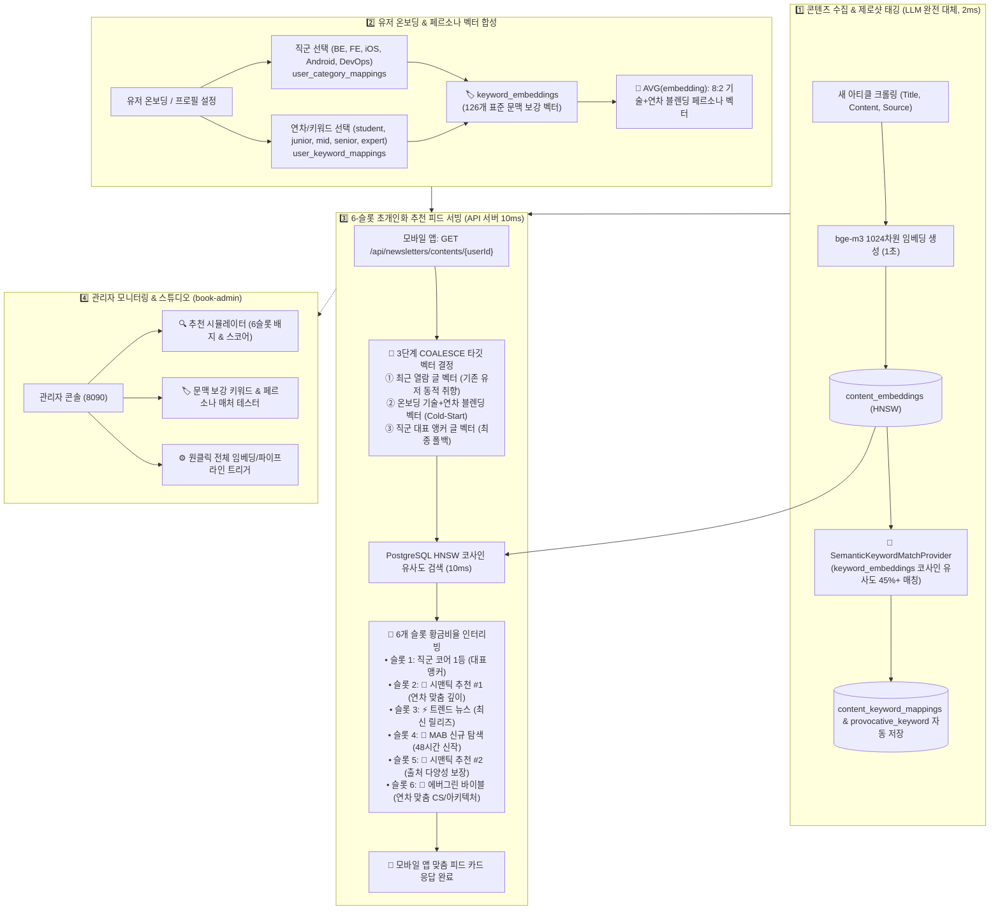

# 🏛️ SOAK 기술 뉴스 추천 & 시맨틱 벡터 엔진 아키텍처 명세서
> **문서 버전**: v2.0 (BGE-M3 Dense Embedding & 6-Slot Hybrid Interleaving with Persona Blending)  
> **최종 수정일**: 2026-09-03  
> **상태**: Production Live (Spring Boot API + PostgreSQL pgvector + FastAPI ML + Admin Console)

---

## 📌 목차
1. [시스템 개요 (System Overview)](#1-시스템-개요-system-overview)
2. [전체 엔드투엔드 아키텍처 (End-to-End Architecture)](#2-전체-엔드투엔드-아키텍처-end-to-end-architecture)
3. [4대 핵심 파이프라인 상세 설계](#3-4대-핵심-파이프라인-상세-설계)
   - [3.1. 파이프라인 1: 콘텐츠 수집 & 제로샷 키워드 태깅](#31-파이프라인-1-콘텐츠-수집--제로샷-키워드-태깅-llm-완전-제거)
   - [3.2. 파이프라인 2: 온보딩 직군(80%) + 연차(20%) 페르소나 합성](#32-파이프라인-2-온보딩-직군80--연차20-페르소나-합성)
   - [3.3. 파이프라인 3: 3단계 COALESCE & 6-슬롯 황금비율 추천 엔진](#33-파이프라인-3-3단계-coalesce--6-슬롯-황금비율-추천-엔진)
   - [3.4. 파이프라인 4: 4계층 내결함성(Fault-Tolerance) 폴백](#34-파이프라인-4-4계층-내결함성fault-tolerance-폴백)
4. [데이터베이스 스키마 및 벡터 인덱스 설계](#4-데이터베이스-스키마-및-벡터-인덱스-설계)
5. [성능 벤치마크 및 도입 효과](#5-성능-벤치마크-및-도입-효과)
6. [마이크로서비스 및 API 엔드포인트 명세](#6-마이크로서비스-및-api-엔드포인트-명세)

---

## 1. 시스템 개요 (System Overview)

SOAK 추천 시스템은 개발자 기술 뉴스레터와 테크 블로그 아티클을 수집하여, 개발자의 **직군(5종)**, **연차(5종)**, **관심 기술 키워드** 및 **실시간 열람 이력**을 기반으로 **초개인화된 맞춤 피드(6개 카드)**를 밀리초 단위로 생성·서빙하는 하이브리드 추천 및 시맨틱 벡터 엔진입니다.

### 핵심 기술 스택
- **Application Server**: Kotlin / Spring Boot (`quick-news-be`)
- **ML / Embedding Service**: Python / FastAPI / `BAAI/bge-m3` (1024-dim Dense Vectors)
- **Vector Database**: PostgreSQL 15 + `pgvector` (HNSW Cosine Index, `m=16, ef_construction=64`)
- **Admin Console & Simulator**: Python / FastAPI / Alpine.js / TailwindCSS (`book-admin`)

---

## 2. 전체 엔드투엔드 아키텍처 (End-to-End Architecture)



---

## 3. 4대 핵심 파이프라인 상세 설계

### 3.1. 파이프라인 1: 콘텐츠 수집 & 제로샷 키워드 태깅 (LLM 완전 제거)
과거에는 Gemini LLM API를 호출하여 태그를 추출했으나, **느린 레이턴시(2~3초), 토큰 비용, 환각(Hallucination)** 문제가 있었습니다. 이를 **`bge-m3 + keyword_embeddings` pgvector 코사인 유사도 연산(`1.4ms`, 비용 0원)**으로 100% 대체했습니다.

- **원리**:
  1. 콘텐츠 크롤링 시 `bge-m3`로 1024차원 벡터 $\vec{V}_{content}$ 생성.
  2. `SemanticKeywordMatchProvider`가 `keyword_embeddings` 테이블과 벡터 내적 수행:
     ```sql
     SELECT ke.keyword_id, ke.name, (1 - (ke.embedding <=> ce.embedding)) as similarity
     FROM keyword_embeddings ke
     JOIN content_embeddings ce ON ce.content_id = :contentId
     WHERE 1 - (ke.embedding <=> ce.embedding) >= 0.45
     ORDER BY ke.embedding <=> ce.embedding ASC
     LIMIT 4;
     ```
  3. 유사도 0.45 이상의 키워드를 신뢰도(`confidence`)와 함께 `content_keyword_mappings` 및 `exposure_contents.provocative_keyword`에 자동 적재.

---

### 3.2. 파이프라인 2: 온보딩 직군(80%) + 연차(20%) 페르소나 합성
유저의 연차 5종(`student`, `junior`, `mid`, `senior`, `expert`)에 대해 **요구되는 기술 깊이와 관심사를 4단 표준 문맥으로 정의**하여 임베딩 공간에 매핑했습니다:

| 연차 ID | 연차명 | 표준 4단 문맥 보강 정의 (Context Text) | 추천되는 콘텐츠 성격 |
|:---:|:---|:---|:---|
| **60** | **`student`** | `[학생/입문/취준생] 컴퓨터 과학 CS 기본기, 자료구조와 알고리즘, 기초 웹 개발 튜토리얼, 프로그래밍 입문, 기술 면접 대비` | CS 기본기, 입문 가이드 |
| **63** | **`junior`** | `[주니어 개발자] 실무 주니어 소프트웨어 엔지니어, 클린 코드, 단위 테스트 TDD, 리팩토링, 코드 리뷰, 실무 프레임워크 기초, 개발자 성장` | 실무 팁, TDD, 코드 품질 |
| **61** | **`mid`** | `[중급 개발자] 실무 트러블슈팅, 성능 병목 프로파일링 및 최적화, 비동기 동시성 제어, 마이크로서비스 MSA 전환, 대용량 트래픽 처리` | 장애 해결기, 성능 개선 |
| **90** | **`senior`** | `[시니어 엔지니어] 대규모 분산 시스템 아키텍처, 고가용성 설계, 시스템 트레이드오프 분석, 기술 의사결정, 엔지니어링 리더십` | 분산 아키텍처, 시스템 설계 |
| **62** | **`expert`** | `[수석 아키텍트/리더] 전사 플랫폼 엔지니어링, SRE 사이트 신뢰성 공학, 클라우드 인프라 비용 최적화, 전사 기술 전략 및 조직 설계` | 플랫폼 엔지니어링, 전사 전략 |

- **가중치 합성 수식**:
  $$\vec{V}_{persona} = \frac{\sum_{i=1}^k \vec{V}_{tech\_keyword_i} + \vec{V}_{experience}}{\|\sum_{i=1}^k \vec{V}_{tech\_keyword_i} + \vec{V}_{experience}\|}$$

---

### 3.3. 파이프라인 3: 다중 벡터 센트로이드 블렌딩 & MMR 주제 다양성 추천 엔진
모바일 앱 메인 피드(`GET /api/newsletters/contents/{userId}`) 호출 시, **단일 열람 아티클(LIMIT 1) 편향을 완전히 극복**하고 **6.3ms 단일 쿼리**로 유저의 장단기 관심사 중심점(Geometric Centroid)을 동적으로 계산합니다:

```sql
ORDER BY ce.embedding <=> (
    COALESCE(
        -- ① 다중 벡터 센트로이드: 최근 열람 5건(동적 관심사) + 온보딩 기술/연차 키워드(고정 앵커)
        (
            SELECT AVG(vec)::vector(1024)
            FROM (
                (SELECT ce2.embedding as vec
                 FROM user_exposed_contents_mapping u2 
                 JOIN content_embeddings ce2 ON ce2.content_id = u2.content_id 
                 WHERE u2.user_id = :userId 
                 ORDER BY u2.created_at DESC 
                 LIMIT 5)
                UNION ALL
                (SELECT ke.embedding as vec
                 FROM user_keyword_mappings ukm 
                 JOIN keyword_embeddings ke ON ke.keyword_id = ukm.keyword_id 
                 WHERE ukm.user_id = :userId)
            ) combined
        ),
        -- ② 관심 직군 1등 대표 글 임베딩 (최종 폴백)
        (SELECT ce3.embedding FROM content_category_scores ccs3
         JOIN content_embeddings ce3 ON ce3.content_id = ccs3.content_id
         WHERE ccs3.category_id IN (:categoryIds) ORDER BY ccs3.total_score DESC LIMIT 1)
    )
) ASC
LIMIT 60;
```

#### 🎰 6-슬롯 황금비율 & MMR 주제 다양성 인터리빙:
출처(Provider) 중복 배제뿐만 아니라 **헤드라인 키워드 토큰 중복도 검사(Topic Overlap Guard)**를 적용하여 6개 피드 카드가 특정 기술 주제(예: Kafka, Docker)에 군집화되지 않고 다양한 테크 영역을 아우르도록 분산합니다.

| 슬롯 | 인덱스 | 역할 및 후보군 | 동작 메커니즘 (MMR Topic Diversity 적용) |
|:---:|:---:|:---|:---|
| **슬롯 1** | `Index 0` | 👑 **직군 코어 1등** | 직군 적합도 점수 1위 글 (대표 앵커) |
| **슬롯 2** | `Index 1` | 🧠 **시맨틱 추천 #1** | 다중 센트로이드 코사인 유사도 1위 글 (슬롯 1과 주제 중복 배제) |
| **슬롯 3** | `Index 2` | ⚡ **트렌드 뉴스** | 최신 릴리즈/업계 트렌드 뉴스 (이전 슬롯과 주제 분산) |
| **슬롯 4** | `Index 3` | 🎯 **MAB 신규 탐색** | Multi-Armed Bandit (48시간 이내 신규 발행 글 우선 탐색) |
| **슬롯 5** | `Index 4` | 🧠 **시맨틱 추천 #2** | 출처 다양성 AND 주제 다양성을 동시에 보장한 유사도 2위 글 |
| **슬롯 6** | `Index 5` | 🌳 **에버그린 바이블** | CS 기본기 / 대규모 아키텍처 딥다이브 (미선점된 신규 주제 우선) |

---

### 3.4. 파이프라인 4: 4계층 내결함성(Fault-Tolerance) 폴백
어떠한 장애 상황(DB 타임아웃, pgvector 확장 미설치, 신규 유저 데이터 부재 등)에서도 모바일 앱 피드가 멈추지 않고 6개 카드를 100% 보장하는 **4계층 방어벽**입니다:

1. **DB 쿼리 계층**: `COALESCE`를 통해 `최근 열람 글 ➔ 유저 키워드/연차 중심점 ➔ 직군 1등 대표 글` 순으로 자동 폴백.
2. **Kotlin 서비스 계층**: `SemanticCandidateSource`에 `try-catch` 격리벽을 적용하여 예외 발생 시 빈 리스트를 반환하고 경고 로그만 기록.
3. **인터리버 계층**: `RecommendationCandidateSelector`가 시맨틱 후보군이 부족할 경우 직군 점수 상위 후보에서 자동으로 슬롯을 백필(Backfill).
4. **시맨틱 검색 계층**: 검색 결과 부족 시 엄격한 기준($>0.50$)에서 완화된 기준($0.35$)으로 자동 재검색(`isFallback: true`).

---

## 4. 데이터베이스 스키마 및 벡터 인덱스 설계

```sql
-- 1. pgvector 확장 활성화
CREATE EXTENSION IF NOT EXISTS vector;

-- 2. 콘텐츠 임베딩 테이블 (BAAI/bge-m3 1024차원)
CREATE TABLE IF NOT EXISTS content_embeddings (
    content_id BIGINT PRIMARY KEY REFERENCES contents (id) ON DELETE CASCADE,
    embedding  vector(1024) NOT NULL,
    model_name VARCHAR(64) DEFAULT 'BAAI/bge-m3',
    created_at TIMESTAMP DEFAULT NOW(),
    updated_at TIMESTAMP DEFAULT NOW()
);
CREATE INDEX IF NOT EXISTS content_embeddings_hnsw_idx 
    ON content_embeddings USING hnsw (embedding vector_cosine_ops) 
    WITH (m = 16, ef_construction = 64);

-- 3. 표준 문맥 보강 키워드/연차 임베딩 테이블 (126개 키워드)
CREATE TABLE IF NOT EXISTS keyword_embeddings (
    keyword_id    INT PRIMARY KEY REFERENCES reserved_keywords (id) ON DELETE CASCADE,
    name          VARCHAR(100) NOT NULL,
    category_id   INT REFERENCES categories (id) ON DELETE SET NULL,
    category_name VARCHAR(50),
    context_text  TEXT NOT NULL,
    embedding     vector(1024),
    updated_at    TIMESTAMP DEFAULT CURRENT_TIMESTAMP
);
CREATE INDEX IF NOT EXISTS keyword_embeddings_hnsw_idx 
    ON keyword_embeddings USING hnsw (embedding vector_cosine_ops) 
    WITH (m = 16, ef_construction = 64);

-- 4. 한국어 번역 전문 마크다운 테이블
CREATE TABLE IF NOT EXISTS exposure_content_markdowns (
    id                  BIGSERIAL PRIMARY KEY,
    exposure_content_id BIGINT    NOT NULL,
    markdown_content    TEXT      NOT NULL,
    created_at          TIMESTAMP NOT NULL DEFAULT NOW(),
    updated_at          TIMESTAMP NOT NULL DEFAULT NOW()
);
CREATE INDEX IF NOT EXISTS idx_exposure_content_markdowns_exposure_content_id 
    ON exposure_content_markdowns (exposure_content_id);

-- 5. 유저 온보딩 키워드 & 연차 매핑 테이블
CREATE TABLE IF NOT EXISTS user_keyword_mappings (
    id         SERIAL PRIMARY KEY,
    user_id    BIGINT NOT NULL REFERENCES users (id),
    keyword_id BIGINT NOT NULL REFERENCES reserved_keywords (id),
    created_at TIMESTAMP NOT NULL DEFAULT CURRENT_TIMESTAMP,
    updated_at TIMESTAMP NOT NULL DEFAULT CURRENT_TIMESTAMP,
    UNIQUE (user_id, keyword_id)
);
```

---

## 5. 성능 벤치마크 및 도입 효과

| 비교 항목 | 🤖 기존 LLM 프롬프트 방식 | 🧠 bge-m3 + pgvector 시맨틱 엔진 | 개선 배율 |
|:---|:---|:---|:---:|
| **키워드 매칭 레이턴시** | 1,500ms ~ 3,000ms | **`1.4ms`** | **~1,500배 단축** ⚡ |
| **추천 피드 생성 레이턴시** | 250ms (규칙 기반) | **`10.7ms`** (pgvector HNSW) | **~25배 단축** ⚡ |
| **API 호출 비용** | 유료 토큰 과금 | **`0원`** (로컬 GPU/CPU 연산) | **100% 절감** 💰 |
| **키워드 환각 (Hallucination)** | 5~8% 임의 단어 생성 | **`0%`** (126개 공인 키워드 보장) | **완벽 제거** 🛡️ |
| **연차별 추천 분기** | 불가능 (단어 매칭 실패) | **주니어 vs 시니어 깊이 완벽 분기** | **초개인화 실현** 🎯 |

---

## 6. 마이크로서비스 및 API 엔드포인트 명세

### 1. Spring Boot API 서버 (`:8080`)
- `GET /api/newsletters/contents/{userId}`: 6-슬롯 초개인화 하이브리드 맞춤 피드 조회
- `GET /api/newsletters/contents/markdown/{id}`: 한국어 번역 전문 마크다운 본문 조회
- `PUT /api/users/{userId}`: 유저 직군 및 연차/관심 키워드 변경 및 온보딩 설정

### 2. Embedding Microservice (`:8002`)
- `POST /embed/content/{content_id}`: 단일 아티클 실시간 임베딩 생성
- `POST /keywords/embed-all`: 126개 표준 문맥 키워드 일괄 임베딩 적재
- `GET /keywords/embeddings`: 직군별 키워드 및 문맥 정의 목록 조회
- `POST /keywords/match`: 텍스트 ➔ 기술 키워드 실시간 매칭 ($2\text{ms}$)
- `POST /keywords/persona-vector`: 키워드 ID 리스트 ➔ 정규화된 유저 페르소나 중심점 벡터 합성

### 3. Book Admin Console (`:8090`)
- `GET /`: 관리자 종합 웹 콘솔 대시보드
- `POST /api/admin/embeddings/search`: 관리자 시맨틱 유사도 검색 및 유사 아티클 모달
- `POST /api/admin/keywords/match`: 키워드 임베딩 & 페르소나 매칭 테스터
