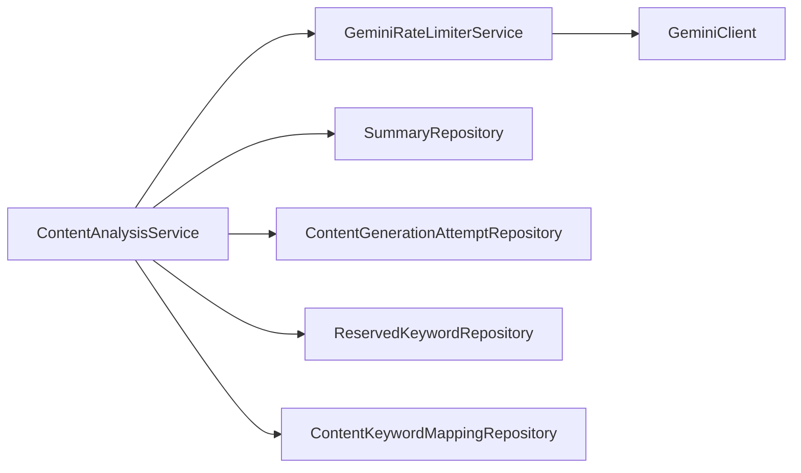
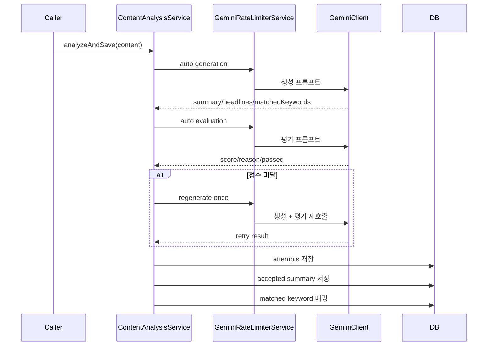
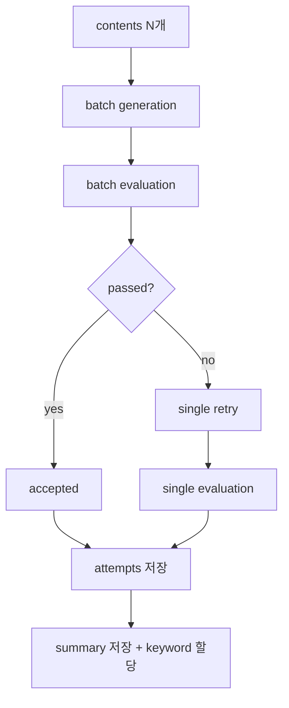

# Human-Like Headline/Summary Pipeline

## 목적

자동처리에서 `AI 티가 강한 헤드라인/요약`을 줄이기 위해 생성과 평가를 분리했다.  
동시에 관리자 키워드 탐색 기능은 기존 출력 계약을 유지해서, 자동처리와 관리자 도구의 책임을 나눴다.

## 핵심 변경

### 1. 생성 계약 분리

- 자동처리 결과
  - `summary`
  - `provocativeHeadlines`
  - `matchedKeywords`
- 관리자 키워드 탐색 결과
  - `matchedKeywords`
  - `suggestedKeywords`
  - `provocativeKeywords`

자동처리에서는 `suggestedKeywords`, `provocativeKeywords`를 제거했다.  
이 두 필드는 실제 저장 후속 처리에 쓰이지 않고, 사람스러운 헤드라인 생성 목표와도 자주 충돌하기 때문이다.

### 2. 2차 자연스러움 평가 추가

- 생성 결과를 별도 평가 프롬프트로 다시 검사한다.
- 점수 범위는 `0-10`
- `minNaturalnessScore` 이상이면 통과
- 미달이면 `maxRegenerationAttempts` 범위 내에서 재생성한다.

### 3. 시도 이력 저장

모든 자동 생성 시도를 `content_generation_attempts`에 남긴다.

- 생성 모드 (`SINGLE`, `BATCH`)
- 시도 순번
- 생성 결과
- 평가 점수/사유
- AI스러운 패턴
- 재생성 횟수
- 최종 채택 여부

최종 채택 결과는 `summaries`에 저장하고, 품질 메타데이터도 함께 남긴다.

## 현재 구조

이번 정리는 `main`의 기존 구조를 최대한 유지하면서, 필요한 책임만 `ContentAnalysisService`와 `GeminiClient`에 직접 추가하는 방향으로 축소했다.

### 책임

- `ContentAnalysisService`
  - 자동 생성
  - 자연스러움 평가
  - 재생성 판단
  - 시도 이력 저장
  - 요약 저장
  - 예약 키워드 할당
- `GeminiClient`
  - 자동 생성 프롬프트
  - legacy 키워드 탐색 프롬프트
  - 자연스러움 평가 프롬프트
  - 프롬프트 수정 제안 프롬프트
  - Gemini JSON schema 정의
- `GeminiRateLimiterService`
  - 모델별 RPM/RPD 제한
  - 생성/평가 요청 공통 실행

## 단건 흐름

## 배치 흐름

배치에서는 1차 생성/평가를 batch로 처리하고, 실패한 항목만 단건 경로로 다시 생성한다.

## 프롬프트 변경 포인트

### 자동 생성 프롬프트

- 헤드라인 길이를 `22-38자` 수준으로 확대
- 더 자연스러운 긍정 예시 추가
- 과장된 클릭베이트 예시를 명시적으로 금지
- 자동처리 결과 계약에서 키워드 아이데이션 필드 제거

### 자연스러움 평가 프롬프트

- `score`
- `reason`
- `aiLikePatterns`
- `recommendedFix`
- `passed`
- `retryCount`

### 프롬프트 수정 제안 프롬프트

입력은 두 개만 받는다.

1. 기존 생성 프롬프트 원문
2. 평가 결과 JSON

이 호출은 내부 유틸리티로만 추가했고, 운영 자동처리 경로에는 연결하지 않았다.

## 저장 모델

### `content_generation_attempts`

생성/평가 시도 이력 저장용 테이블.

### `summaries`

기존 요약 저장에 아래 필드를 추가했다.

- `generation_attempt_id`
- `quality_score`
- `quality_reason`
- `retry_count`

## 설정

`ai.gemini.content-analysis`

- `minNaturalnessScore=7`
- `maxRegenerationAttempts=1`

## 확인 포인트

- 자동처리 응답에는 `qualityScore`, `qualityReason`, `retryCount`가 포함된다.
- 관리자 키워드 탐색은 여전히 `suggestedKeywords`, `provocativeKeywords`를 반환한다.
- 자연스러움 평가 실패 시에도 시도 이력은 DB에 남는다.
