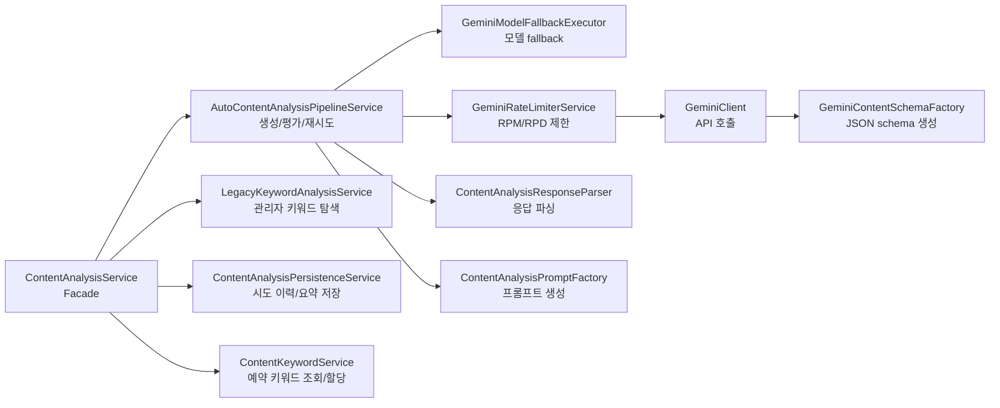
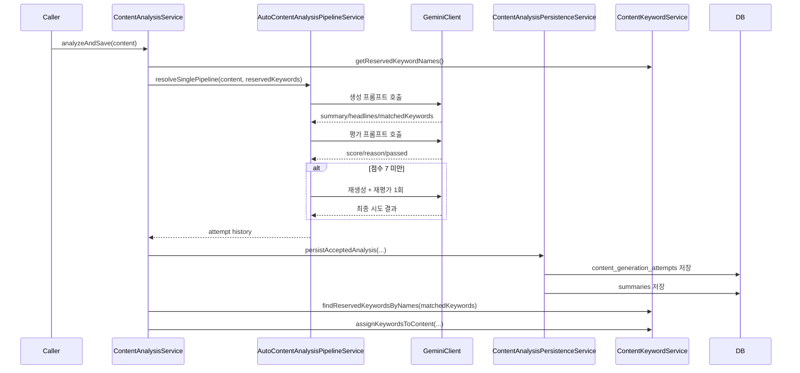
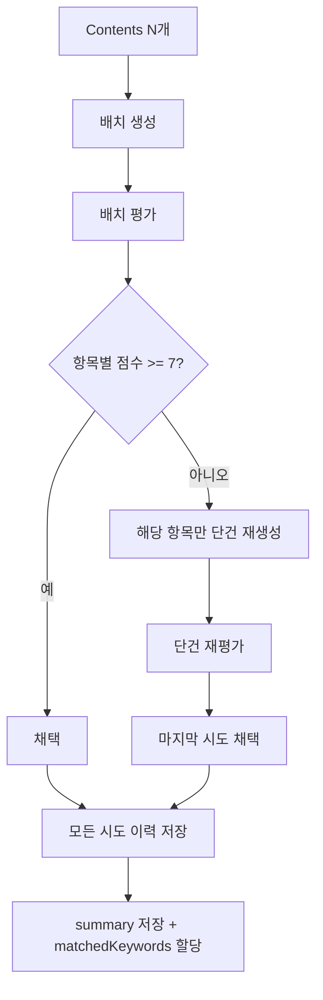

# Human-Like Headline/Summary Pipeline

## 문서 목적

이 문서는 최근 적용한 `AI스럽지 않은 헤드라인/요약 생성` 변경 사항을 설명한다.

- 자동처리용 생성 계약과 관리자용 키워드 탐색 계약을 왜 분리했는지
- 프롬프트, 평가, 재생성, 저장 흐름이 어떻게 동작하는지
- SOLID 원칙 기준으로 어떤 책임 분리가 적용되었는지
- 운영과 테스트 관점에서 어디를 보면 되는지

## 변경 배경

기존에는 하나의 분석 흐름 안에서 아래 책임이 섞여 있었다.

- 요약 생성
- 자극적인 헤드라인 생성
- 예약 키워드 매칭
- 추천 키워드 제안
- 자극 키워드 제안

이 구조는 두 가지 문제가 있었다.

1. 자동처리의 핵심 목표인 `사람처럼 자연스러운 요약/헤드라인` 생성과 `키워드 아이데이션`이 한 프롬프트 안에서 경쟁했다.
2. 저장, 재시도, 평가, 키워드 할당까지 하나의 서비스에 몰려 있어서 책임 경계가 흐렸다.

이번 변경은 자동처리 품질을 우선하도록 계약을 줄이고, 파이프라인과 저장 책임을 분리하는 방향으로 진행되었다.

## 핵심 변경 요약

### 1. 생성 계약 분리

자동처리용 계약과 관리자 키워드 탐색용 계약을 분리했다.

| 구분 | 목적 | 출력 필드 |
| --- | --- | --- |
| Auto generation | 요약/헤드라인 생성 + 실제 예약 키워드 매칭 | `summary`, `provocativeHeadlines`, `matchedKeywords` |
| Legacy keyword discovery | 관리자용 키워드 탐색 | `matchedKeywords`, `suggestedKeywords`, `provocativeKeywords` |

자동처리 결과에서는 `suggestedKeywords`, `provocativeKeywords`를 제거했다.

이유는 다음과 같다.

- 자동처리의 저장 후속 작업은 실제로 `matchedKeywords`만 사용한다.
- `suggestedKeywords`, `provocativeKeywords`는 아이데이션 성격이 강해서 헤드라인 자연스러움 목표와 충돌한다.
- 출력 계약을 줄이면 프롬프트가 더 선명해지고, 평가 기준도 요약/헤드라인 품질에 집중할 수 있다.

반대로 관리자 화면에서 예약 키워드 후보를 검토하는 흐름은 그대로 유지해야 하므로, legacy 계약은 별도로 남겼다.

## 아키텍처 개요

### 책임 분리 기준

- `ContentAnalysisService`
  - 외부 사용자가 호출하는 퍼사드
  - 고수준 유즈케이스만 조합
- `AutoContentAnalysisPipelineService`
  - 생성, 평가, 배치 처리, 재생성 정책 담당
- `LegacyKeywordAnalysisService`
  - 관리자 키워드 탐색 전용 호출 담당
- `ContentAnalysisPersistenceService`
  - 시도 이력과 최종 요약 저장 담당
- `ContentKeywordService`
  - 예약 키워드 조회, 매핑, 후보 승격 담당
- `GeminiModelFallbackExecutor`
  - 모델 순회와 fallback 정책 담당
- `GeminiClient`
  - 외부 API transport 담당
- `GeminiContentSchemaFactory`
  - Gemini JSON schema 생성 담당

## 프롬프트 구조

이번 변경으로 프롬프트는 3단계로 정리되었다.

### 1단계. 생성 프롬프트

목표:

- 사람 편집자가 다듬은 듯한 요약 생성
- AI 티가 적은 헤드라인 생성
- 실제 관련 있는 예약 키워드만 매칭

주요 규칙:

- 헤드라인 길이 확대: `22-38자`
- 자연스러운 예시 강화
- 상투적 클릭베이트 예시를 명시적으로 금지
- 자동처리 계약에서는 `suggestedKeywords`, `provocativeKeywords` 제거

### 2단계. 자연스러움 평가 프롬프트

목표:

- 생성 결과가 얼마나 사람 편집자처럼 자연스러운지 점수화
- AI스러운 표현 패턴을 구조화해서 반환
- 재생성 여부 판단

평가 출력:

- `score`
- `reason`
- `aiLikePatterns`
- `recommendedFix`
- `passed`
- `retryCount`

기본 기준:

- `score >= 7` 이면 통과
- 그 미만이면 1회 재생성

### 3단계. 프롬프트 수정 제안 프롬프트

목표:

- 생성 프롬프트 원문
- 2단계 평가 결과

위 두 입력만 받아서, 이후 프롬프트 개선안을 제안하는 내부용 도구를 제공한다.

이 기능은 현재 런타임 자동처리에는 연결하지 않았고, 백엔드 내부 유틸리티 성격으로만 추가했다.

## 자동처리 단건 흐름

### 단건 처리 상세 규칙

1. 예약 키워드 이름 목록을 먼저 읽는다.
2. 생성 프롬프트로 요약/헤드라인/매칭 키워드를 만든다.
3. 평가 프롬프트로 자연스러움을 평가한다.
4. 점수가 임계값 미만이면 최대 1회 다시 생성한다.
5. 모든 시도 결과를 `content_generation_attempts`에 저장한다.
6. 마지막으로 채택된 결과를 `summaries`에 저장한다.
7. 채택된 결과의 `matchedKeywords`만 실제 콘텐츠에 할당한다.

## 자동처리 배치 흐름

### 배치 처리 상세 규칙

- 1차 생성과 1차 평가는 batch API로 처리한다.
- 배치 평가에서 실패한 항목만 단건 경로로 재시도한다.
- 배치 응답에서 특정 항목이 누락되면 그 항목은 단건 경로로 fallback 한다.
- 저장은 항목별로 분리되며, 실패 이력도 모두 남긴다.

## 데이터 모델 변경

### 1. `content_generation_attempts`

각 생성 시도를 남기는 신규 테이블이다.

주요 컬럼:

- `content_id`
- `generation_mode`
- `attempt_number`
- `model`
- `prompt_version`
- `generated_summary`
- `generated_headlines`
- `matched_keywords`
- `quality_score`
- `quality_reason`
- `ai_like_patterns`
- `recommended_fix`
- `passed`
- `accepted`
- `retry_count`

### 2. `summaries`

최종 채택된 요약이 들어가는 기존 테이블에 아래 메타데이터를 추가했다.

- `generation_attempt_id`
- `quality_score`
- `quality_reason`
- `retry_count`

즉, `summaries`는 사용자/운영자가 실제 소비하는 최종 결과를 담고, `content_generation_attempts`는 생성 품질 추적용 이력을 담는다.

## 관리자 화면과 응답 변경

자동처리와 저장 요약 조회 응답에 품질 메타데이터를 추가했다.

- `qualityScore`
- `qualityReason`
- `retryCount`

관리자 UI에서는 다음 위치에서 이 값을 보여준다.

- 자동처리 완료 카드
- 콘텐츠 사이드바 최신 요약 영역
- 저장된 요약 목록 카드

반면, 예약 키워드 추천/추가 UI는 여전히 legacy 계약을 사용한다.

## SOLID 기준 리팩토링 설명

### SRP

기존에는 하나의 서비스가 아래를 모두 담당했다.

- 모델 fallback
- 생성/평가 호출
- 재시도 정책
- DB 저장
- 예약 키워드 매핑

지금은 역할별 서비스로 분리했다.

### OCP

새로운 생성 정책이나 평가 정책을 넣을 때 퍼사드를 거의 건드리지 않고 파이프라인 내부 구현만 확장할 수 있다.

예:

- 평가 임계값 변경
- 재생성 횟수 증가
- batch 재시도 정책 변경
- 다른 schema 전략 추가

### ISP

자동처리 경로는 더 이상 `suggestedKeywords`, `provocativeKeywords`에 의존하지 않는다.
필요한 계약만 소비하도록 인터페이스가 좁아졌다.

### DIP

고수준 유즈케이스는 아래 세부 구현에 직접 매이지 않는다.

- Gemini transport
- schema 생성
- fallback 정책
- 저장 로직

대신 역할 서비스 조합으로 의존성이 낮아졌다.

## 설정

설정 경로:

- `ai.gemini.content-analysis.min-naturalness-score`
- `ai.gemini.content-analysis.max-regeneration-attempts`

기본값:

- 최소 자연스러움 점수: `7`
- 최대 재생성 횟수: `1`

## 테스트 전략

추가된 테스트 범위는 다음과 같다.

- 프롬프트 빌더 테스트
  - 자동 생성 프롬프트에서 불필요 필드 제거 여부
  - 자연스러운/비권장 헤드라인 가이드 포함 여부
- 응답 파서 테스트
  - 생성/평가/배치 평가 JSON 파싱
- 서비스 테스트
  - 1회 통과
  - 재생성 후 통과
  - 배치 부분 재시도
  - 재시도 소진
  - rate limit / parse failure
- 저장 계층 테스트
  - 실패 시도 + 채택 시도 저장
  - summary와 accepted attempt 연결
- 관리자 응답 테스트
  - 품질 점수/사유/재생성 횟수 노출

## 운영 관점 체크 포인트

### 로그와 이력으로 확인 가능한 것

- 어떤 모델이 생성/평가에 사용됐는지
- 몇 번째 시도에서 채택됐는지
- 왜 낮은 점수를 받았는지
- 어떤 AI-like pattern이 검출됐는지

### 주의할 점

- 기존 DB에는 `summaries` 컬럼 추가까지만 반영되므로, 운영 migration 정책에 따라 FK 보강은 별도 migration으로 정리하는 편이 안전하다.
- 관리자 UI에서 키워드 제안이 필요한 화면은 legacy 계약을 계속 써야 한다.
- 자동처리 결과 계약을 다시 늘리면 자연스러움 평가의 일관성이 다시 깨질 수 있다.

## 빠른 FAQ

### 왜 `suggestedKeywords`, `provocativeKeywords`를 자동처리에서 제거했나?

자동처리의 목적은 `사람스러운 요약/헤드라인 생성`과 `실제 매칭 예약 키워드 반영`이다.
추천 키워드와 자극 키워드는 관리자 검토용 아이데이션 성격이 강하므로, 자동처리 계약에 남겨두면 모델의 주의가 분산된다.

따라서:

- 자동처리 계약은 줄이고
- 관리자 키워드 탐색 계약은 유지했다

이 분리가 현재 구조의 핵심이다.

## 관련 코드 위치

- 퍼사드: `external/.../service/ContentAnalysisService.kt`
- 자동처리 파이프라인: `external/.../service/AutoContentAnalysisPipelineService.kt`
- legacy 키워드 분석: `external/.../service/LegacyKeywordAnalysisService.kt`
- 시도 이력/요약 저장: `external/.../service/ContentAnalysisPersistenceService.kt`
- 키워드 조회/할당: `external/.../service/ContentKeywordService.kt`
- 모델 fallback: `external/.../service/GeminiModelFallbackExecutor.kt`
- 프롬프트: `external/.../service/ContentAnalysisPromptFactory.kt`
- 파서: `external/.../service/ContentAnalysisResponseParser.kt`
- Gemini schema: `external/.../apiclient/GeminiContentSchemaFactory.kt`
- DB 스키마: `external/src/main/resources/schema.sql`
